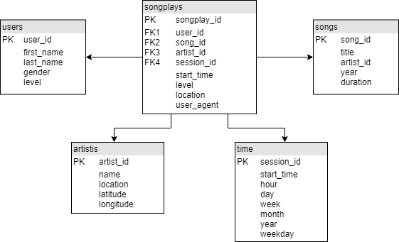

# Introduction

This project is part of Udemy's Data Engineering Course.

The code was written along the lines of the default Jupyter notebook workspace provided by Udemy.

Author: [Davidson de Faria](https://github.com/davidsondefaria)

## Sumário

 - create_tables.py: This file will manage de database, creating and droping the tables;
 - sql_queries.py: This file contains the python alias for querys used in Postgres;
 - etl.py: Project core. Here, we process the data contained in dataset, getting information in song_data and log_data and inserting into database created by `create_tables.py`;
 - etl.ipynb: Provided by Udemy, this files contains a Jupyter notebook codes for learning and testing;
 - test.ipynb: Provided by Udemy, this files contains a Jupyter notebook for test our program;
 - data: This folder contains the dataset.
 
## How to Run

 - In a Jupyter Notebook, open a terminal and type: `python3 create_tables.py`;
 - Then, type: `python3 etl.py`;
 - To verify the results, run all cells of `test.py`.
 
## Goals

The main goal of this project is to learn how manipulate data. So we supose a music startup named by `Sparkfy` who desire to analyze the data of their collecting song and the user activity. 

To do this, we serpate the data into in 4 dimensional tables and 1 fact table, as shown in the picture,

and getting informations from data set and inserting into song table and artist table. Also, we get the log file to control the user activity and insert the log into user table and time table.

To complete songplay table, we have to search the song and artist table to get the correct id.